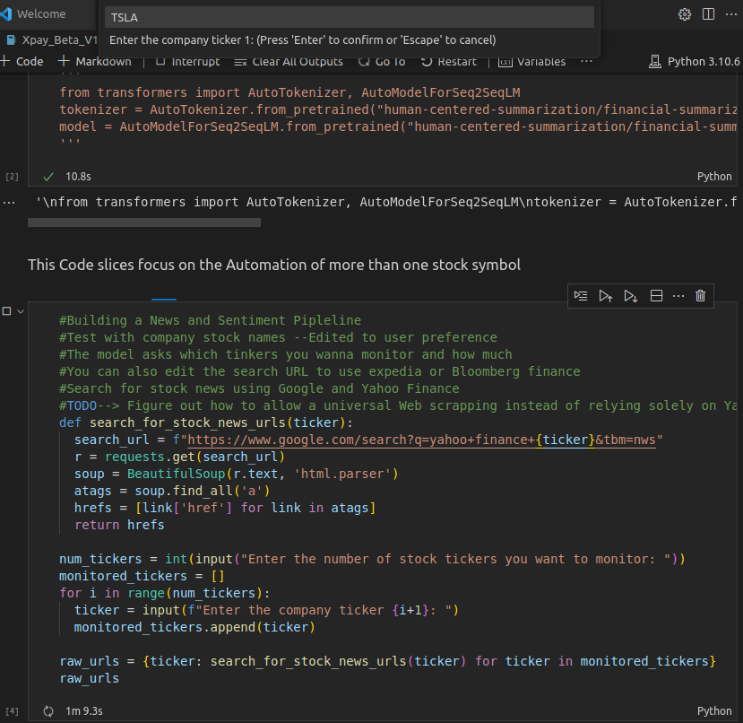
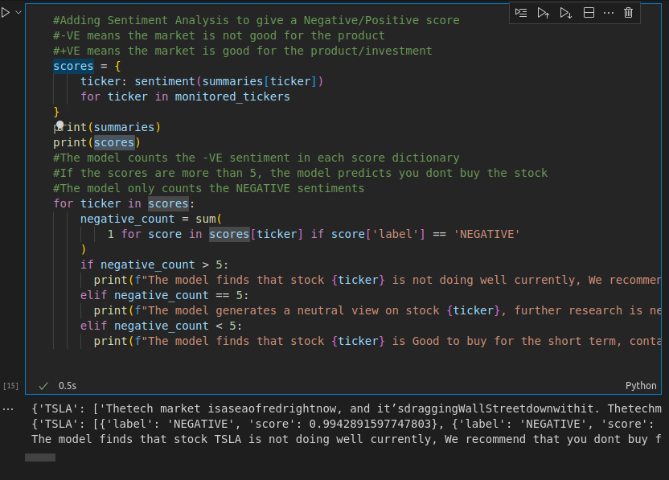

# XPay_Finance_Beta
Machine Learning Project that uses BERT Deep Learning and Encoder-Decoder NLP
NB : This ML model is under Training and may occasionally generate wrong Data

# Installing & Usage
1. clone the repo to your local machine ; Open in VScode (Have Jupyter Environment installed)
2. Open Terminal and Run `pip install sentencepiece tensorflow requests re bs4 transformers torch`
3. Start Running the code blocks one by one 
4. In when you reach code 3, Input the Number of tickers you want to monitor

5. Still in Code block 3, Input the Stock Ticker(I used "TSLA")

6. Run the code blocks and observe the output from block 8 

# Collaboration Request
contact me here : https://www.linkedin.com/in/misango/