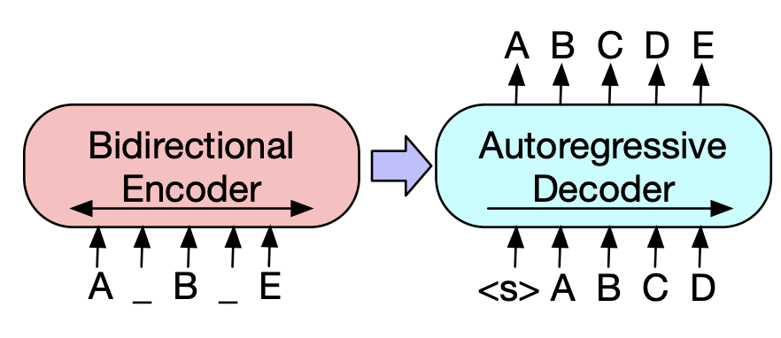

# XPay_Finance_Beta
Machine Learning Project that uses BERT Deep Learning and Encoder-Decoder NLP
NB : This ML model is Novel and may occasionally generate wrong Data

## Theoretical Background 

### Architectures 

# Installing & Usage

1. clone the repo to your local machine ; Open in VScode (Have Jupyter Environment installed)
2. Open Terminal and Run `pip install requirements.txt`
3. In the same terminal window, run streamlit run app.py
4. As on the window above, a stock ticker is the 4-code stock symbol i.e APPL
5. The model takes a few minutes to train and output per stock ticker
contact me here : https://www.linkedin.com/in/misango/